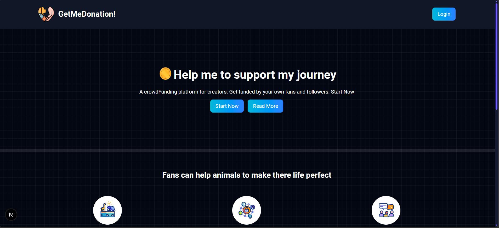
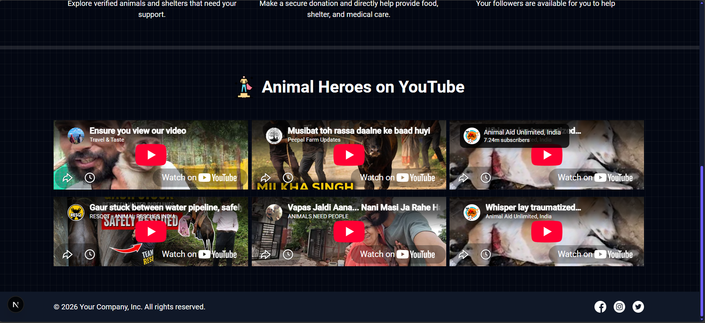
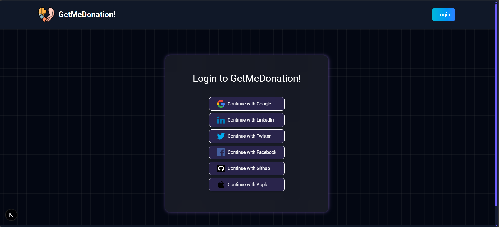
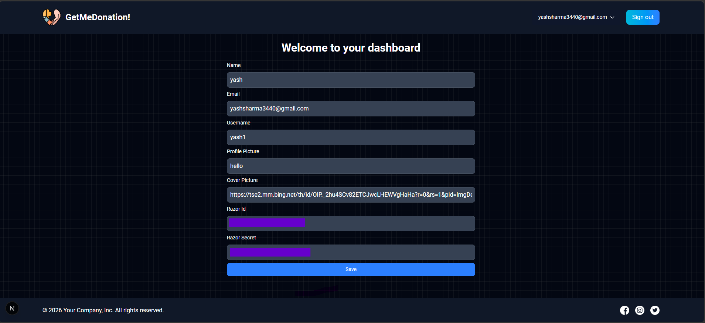
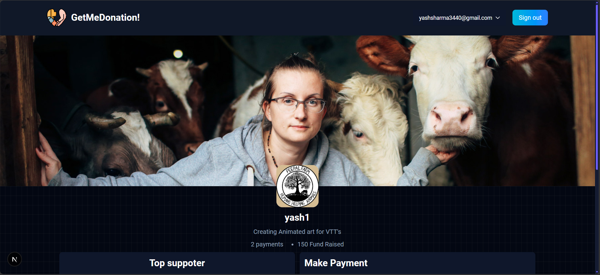
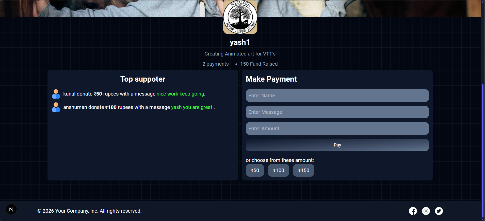
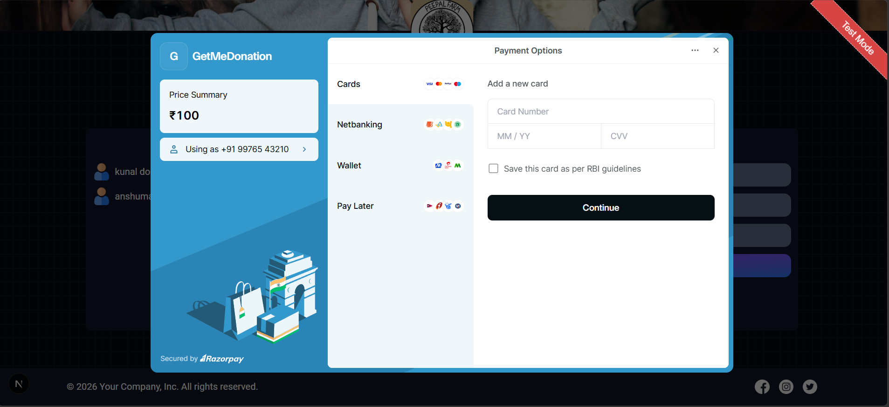

# GetMeDonation 💙

A full-stack donation platform built with Next.js that allows users to support animal shelters through online donations.

## 🌐 Live Demo

Coming soon...

## 📸 Screenshots

### Home Page




### Login Page



### Dashboard



### Payment Page




### Razorpay



## ✨ Features

- User authentication with NextAuth
- User registration and login
- Dynamic user profiles
- Donation functionality
- Razorpay payment integration
- Payment verification
- MongoDB database
- Responsive UI
- Protected routes
- Donation messages
- Payment history

## 🛠️ Tech Stack

### Frontend
- Next.js
- React
- JavaScript
- Tailwind CSS

### Backend
- Next.js API Routes
- MongoDB
- Mongoose

### Authentication
- NextAuth

### Payments
- Razorpay


## Installation

Clone the repository:

git clone https://github.com/YOUR_USERNAME/getmedonation.git

Move into the project:

cd getmedonation

Install dependencies:

npm install

Run the development server:

npm run dev

## 📁 Project Structure

```text
GetMeDonation/
├── actions/
├── app/
│   ├── about/
│   ├── api/
│   │   └── razorpay/
│   └── ...
├── components/
├── models/
├── public/
├── .env.example
├── .gitignore
├── package.json
└── README.md

